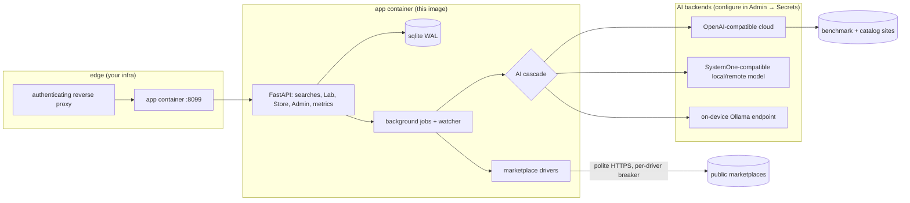

# ARCHITECTURE.md — how deal-radar runs (generic: no hosts, IPs, or personal infra here)

Request flow: UI (Vue SPA, same origin) → `POST /searches` → job row in sqlite →
asyncio worker fans out to drivers (guarded: retry → breaker with cooldown → clean
per-source error, never fails the whole search) → cheap scoring → Stage B (model
verification for borderline items) → detail/vision/benchmark enrichment → merged,
flagged-not-dropped results + snapshot persisted. Polling (`GET /searches/{id}`) streams
progressive partials; SSE `/stream` pushes matches and price events. Watches re-poll on
schedule with per-watch rules; tracked products version every change (observations).

## Drivers (all implement `MarketplaceDriver`: `search()` + `fetch_detail()`)

| driver | access mode | pagination | categories | notes |
|---|---|---|---|---|
| willhaben | public web (`__NEXT_DATA__`) | walk to exhaustion | facet tree via `ATTRIBUTE_TREE` | unfiltered dumps detected + refused |
| kleinanzeigen | public web (SSR) | pagination hrefs | slug map | 403 → clean error + proxy hint |
| vinted | public web (SSR) | next-page links | `/catalog/<id>-<slug>` nav | shipping-first market |
| shpock | public web (SSR apollo) | first page only | — (blocked: needs persisted-query hash) | keyword-ignored dumps raise loudly |
| ricardo | — | blocked (403 wall) | — | clean error, never faked |
| ebay | official Browse API | `limit` pages | API facets | needs App ID + Cert ID (auto-mints token) |

New community drivers hot-load via the Store (contract test in `registry.check`), no restart.

## Enrichment fabric (all implement `Enricher`: `supports()` + `enrich()`)

- **cpu**: exact mention → verified fact; known model line + vague chip → labeled family
  estimate + `cpu_candidates` suggestions (tap-to-set in drawer); truly unknown → honest empty.
- **cpu_benchmark / gpu_benchmark**: live PassMark marks (disk-cached, ~1 req/s), static fallback table.
- **market_cohort**: median/position vs the live result set.
- **Lab-built**: generated from plain words, sandboxed, contract-checked, hot-loaded.

## Hardening

- Strict CSP (`script-src 'self'`, no inline), nosniff/SAMEORIGIN/referrer/HSTS headers.
- SSRF guard on image downloads (no private/loopback/link-local, 3 redirects, 8 MB cap).
- Lab code runs in a locked-down subprocess first (scrubbed env, rlimits, egress allowlist).
- Input bounds everywhere (422s), login + rate limits + API key supported, `/docs` gated when auth is on.
- Secrets only via env or Admin → Secrets UI (never returned by any endpoint, never in git).
- Polite scraping: ≤1 req/s per driver, caching, small samples in tests; blocked drivers degrade honestly.
